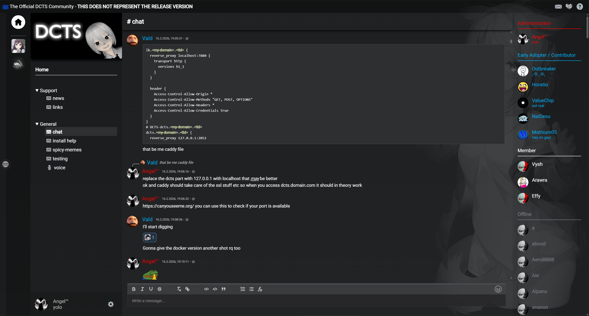

# DCTS - Direct Communication Through Sockets
[Visit our subreddit](https://www.reddit.com/r/dcts/) • [Feature list](https://github.com/hackthedev/dcts-shipping/blob/beta/docs/Feature%20List.md) • [Discord for convenience](https://discord.gg/AYq8hbRHNR) • [Public Instance](https://chat.network-z.com/) • [To-Do list](https://github.com/users/hackthedev/projects/6/views/1?filterQuery=-changelog-status%3AAdded+-status%3ACanceled) • [Tutorial Playlist](https://www.youtube.com/watch?v=b1RXJ-ykdgc&list=PL2xF-BCo1FWav36ktSvBG4nDsbhfLkFR-&index=1) • [Forum](https://dcts.community/)

[](https://ko-fi.com/M4M719FPNG) 

This project was made with the goal to provide a platform that aims to fix issues with existing solutions like Discord, TeamSpeak, Revolt, Fosscord, Matrix, TeaSpeak and all others out there and to create new, advanced and easy to use features while creating as little friction as possible and keeping things intuitive.

Although there are still some rough edges and a few missing features, DCTS is evolving rapidly due to the massive amount of work being put into its development. This includes adding new features as well as refining existing ones or improving the general experience. Compared to other alternatives, DCTS is evolving lightning fast.

**If you need help** or wanna reach out to me feel free to create a **post on** the **subreddit/forum**, **message** me **on discord**, or text me **on signal: shydevil.89**.



*(^ this is just custom theme thats included too, in case you may not like anime its not the default)*


------

## Support the Project <3

Without community support, development may slow down significantly and could even come to a halt over time :(

If you value the vision of DCTS and want to see it grow, consider making a donation. Every contribution helps accelerate development and ensures the project's future. Thank you for helping to keep DCTS alive!

- [Donate via PayPal](https://www.paypal.me/devilsstore) / [Ko-fi](https://ko-fi.com/shydevil)
- [Bitcoin](https://mempool.space/address/bc1qeu9j4xh8qhya3s47j05yu78rla3hxe2yz65c9z) (BTC)
- [Ethereum](https://etherscan.io/address/0x1DeCAf1A2C933d6806C87b08Ad56Cbfbb9021aE3) (ETC)

> [!TIP]
>
> You can also **support the project by** regularly **sharing it and letting** as many **people know**  about it as possible!

------

## Why DCTS?

> [!NOTE]
> DCTS is still in development. Some features may not yet be fully refined.

Many platforms out there have quite some fundamental issues and other problems. DCTS was born with the goal to make a platform thats as independent and stable as possible for a long time to come.

**Heres a short list of the cool things DCTS has to offer:**

- **Encrypted DMs**: By using the [desktop client](https://github.com/hackthedev/dcts-client-shipping/) you can have E2EE DMs (end-to-end-encrypted).
- **VoIP & Screensharing:** DCTS has Voice Chat with Opus and amazing Screenshare quality and supports 4K screensharing @ 120 FPS with max 50 Mbit bitrate. These are default limits for now and can be easily extended.
- **Decentralized:** DCTS will use a [custom-made library](https://www.npmjs.com/package/@hackthedev/dsync) for communication between other servers and has a seamless, decentralized instance list built-in as well as discovery.
- **Independent:** *A lot* of libraries are custom-made to guarantee long-term stability and independence and will avoid any deals or investors to keep it like that. 
- **Customization**: DCTS can be highly customized with plugins and themes. Additionally there are a lot of helpful settings that can be changed to your heart's belonging.
- **Simplicity:** Everything is made to be simple, intuitive and easy to use. A basic local non-docker setup can be running in about 10 minutes.
- **Community-Driven:** *A lot* is happening based on community feedback and the current situation.
- **No Paywalls:** DCTS will never implement subscriptions or other bullshit and will continue to stay free even for commercial use. The development of DCTS in terms of cost is so efficient that it can run easily on donations and worse case even without.
- **Scalable & Lightweight:** Given DCTS is super **lightweight** and uses bun, MariaDB, Livekit etc it would be roughly estimated that there could be 2000-5000 **concurrent** users online with about 300-800 actively chatting and causing other server load on average hardware. This is not the limit to whats possible!
- **Quick Development:** There are pretty much multiple daily commits and frequent beta updates to ensure bugs are fixed while also refactoring parts of the code to keep the code base from becoming a monster.

- **Account Export**: Accounts can be exported and re-imported in other servers. Soon the desktop client will take care about that automatically.

While DCTS is an app, its going to be part of a bigger ecosystem in order to make the web a better place because we still need proper alternatives in other areas too. A **Reddit** and **Tenor** alternative are already being worked on and basics almost done. 

> [!TIP]
>
> Checkout the Feature list in `/docs/Feature List.md` if you're curious about more

------

## Installing
### Docker Installation

> [!IMPORTANT]
>
> Make sure that you have a reverse proxy setup for your chat instance! Checkout the docs folder!

```bash
wget https://raw.githubusercontent.com/hackthedev/dcts-shipping/refs/heads/main/docker-compose.yml
docker compose up
```

or alternatively:

```bash
# You can choose between these tags
sudo docker pull ghcr.io/hackthedev/dcts-shipping:latest # :latest, :main or :beta
sudo docker run --rm -p 2052:2052 ghcr.io/hackthedev/dcts-shipping:latest # :latest, :main or :beta
```

#### Accessing the server

- Open your browser and go to `http://localhost:2052` (or your server's IP).
- If you just want to try DCTS, you can visit the public instance at [https://chat.network-z.com/](https://chat.network-z.com/).

> [!TIP]
>
> Docker was made possible thanks to people like **panda**, **Reeperk** ,**Animo**. and **Luna/wunadacat**.

<br>

## Manual Install

```bash
# Install database.
# Note that you may need to configure a user afterwards
apt install mariadb-server mariadb-client -y

# Install Bun
curl -fsSL https://bun.com/install | bash

# Download latest version
wget -O dcts-shipping-latest.zip \
  https://github.com/hackthedev/dcts-shipping/releases/latest/download/dcts-shipping.zip

# Unzip into current folder
unzip dcts-shipping-latest.zip -d .

# Install packages
bun install

# Start server to generate config
bun .
```

You may get an error or warning telling you to edit the `configs/config.json` file on successful installation. From this point on you just enter the sql connection info into the `sql` section found in the config file and you should be good to go.

> [!TIP]
>
> At the very top of the repo is a linked youtube playlist. The setup is pretty much the same for linux. A linux playlist will be made as well soon.

> [!NOTE]
>
> This is only the very basic setup. Checkout the `docs` folder for more information. I recommend viewing them on Github. 

------

## Tested Versions

### Bun:

- ✔️ 1.3.5

### Node:

- ✔️ v24.11.1
- ✔️ v21.7.3
- ✔️ v20.19.2
- ✔️ v18.20.2
- ✔️ v16.16.0
- 🚫 v12.22.9

[^1]: When user A sends user B a message, only user A and B can decrypt the message. When user B reports the message sent by user A, user B creates a report with the encrypted data and decrypted message. Based on the decrypted plain text from user B and public key from user A, its possible to verify the encrypted data by any third party, tho only user A and B can actually decrypt it.
